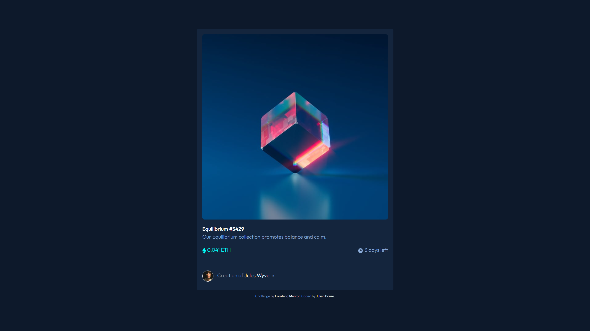
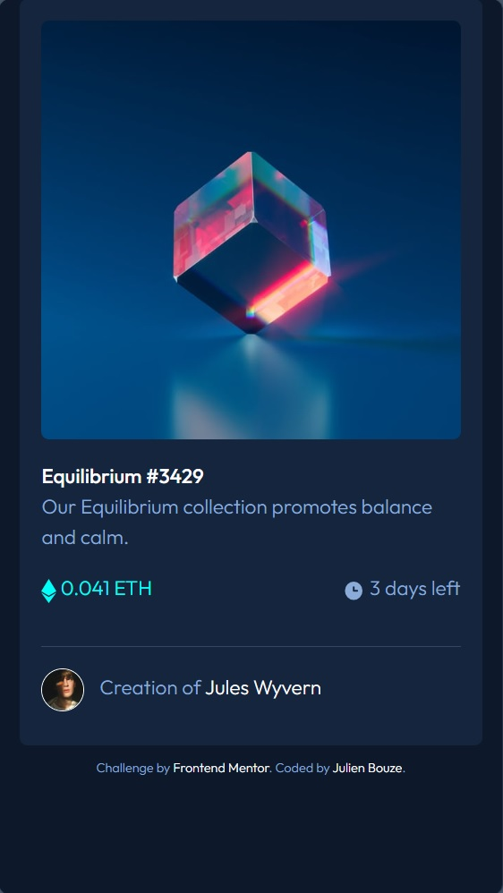

# Frontend Mentor - NFT preview card component solution

This is a solution to the [NFT preview card component challenge on Frontend Mentor](https://www.frontendmentor.io/challenges/nft-preview-card-component-SbdUL_w0U). Frontend Mentor challenges help you improve your coding skills by building realistic projects.

## Table of contents

- [Overview](#overview)
    - [The challenge](#the-challenge)
    - [Screenshot](#screenshot)
    - [Links](#links)
- [My process](#my-process)
    - [Built with](#built-with)
    - [Continued development](#continued-development)
- [Author](#author)

## Overview

### Screenshot

### Links

- Solution URL: https://github.com/julienbouze/Nft-preview-card-component
- Live Site URL: https://julienbouze.github.io/Nft-preview-card-component/

## My process

### Built with

- Semantic HTML5 markup
- CSS custom properties
- Boostrap

### What I learned

I learned the use of Bootstrap

### Continued development

I want to keep improving my knowledge on Bootstrap

## Author

- Github - https://github.com/julienbouze
- Frontend Mentor - https://www.frontendmentor.io/profile/julienbouze